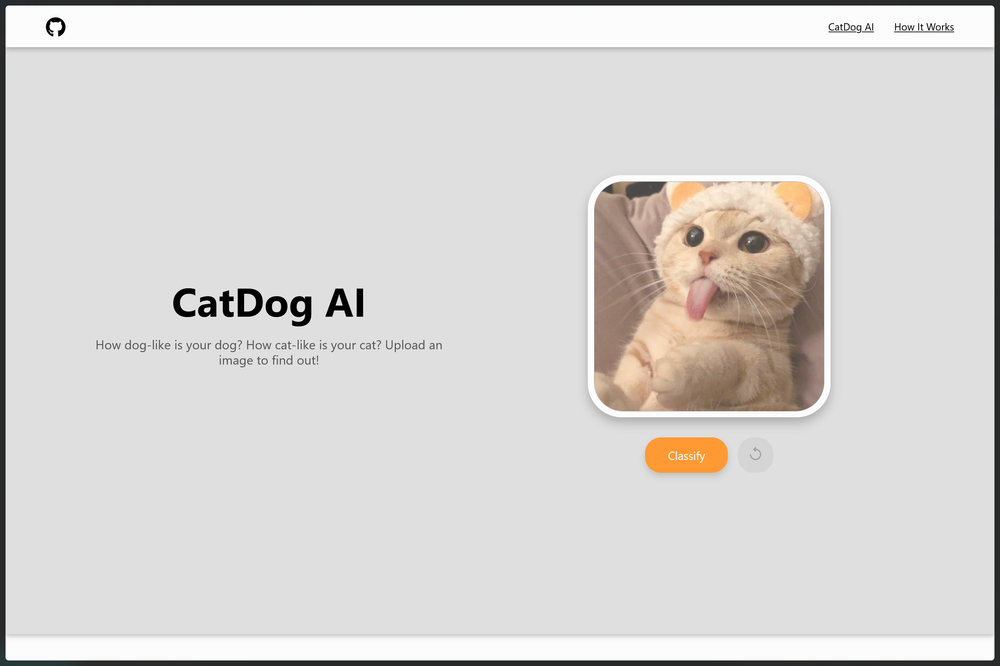
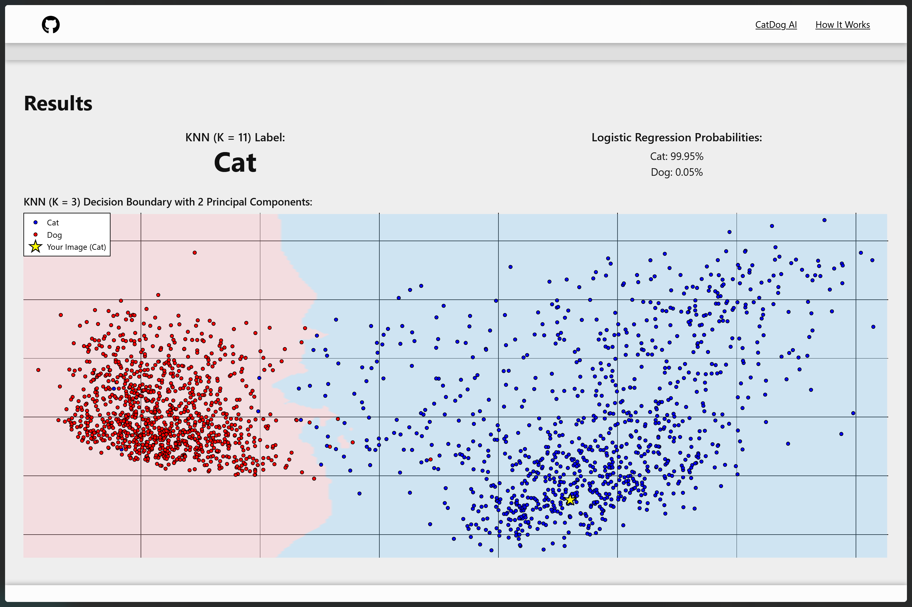

# CatDog AI Classifier App

**How cat-like is your dog? How dog-like is your cat?**

**Upload an image to instantly find out whether it's more cat or more dog with visualized decision boundaries and model confidence scores.**


## Table of Contents
- [Screenshots](#screenshots)
- [Description](#description)
- [Installation](#installation)
- [How to Use](#how-to-use)
- [Tech Stack / Libraries Used](#tech-stack--libraries-used)
- [License](#license)

---

##  Screenshots

>  Landing Section:


>  Results After The User Uploads An Image:


---

##  Description

This project is a full-stack image classifier web app that:
- Lets users upload images of cats and dogs
- Uses pretrained ResNet50 embeddings with KNN and Logistic Regression classifiers
- Shows prediction results + a 2D visual of the model's decision space

All models and EDA are built in this **repo**:
[Cat vs Dog Image Analysis – EDA & Model Selection](https://github.com/mooogy/catdog-image-analysis)

---

## Installation

### Option 1: Using Docker (**Recommended**)

```bash
docker pull mooogy/catdog-ai
docker run -p 8000:8000 mooogy/catdog-ai # launches at http://localhost:8000
```

### Option 2: Local Setup using Python + Make

```bash
git clone https://github.com/mooogy/catdog-ai.git
cd catdog-ai
make run  # launches at http://localhost:8000
```

---

## How to Use

1. Open your browser and go to [http://localhost:8000](http://localhost:8000)
2. Upload an image of a cat or dog
3. View the prediction, model probabilities, and decision boundary
4. Use the reset button to try a new image

---

## Tech Stack / Libraries Used

---

## License

This project is licensed under the [MIT License](LICENSE).
